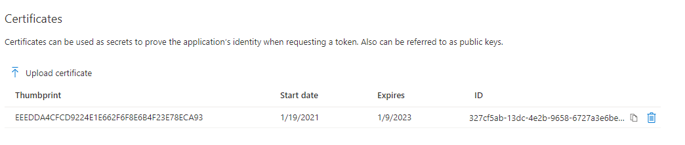

# Azure AD Client Credentials with Certificate - Code Examples for Node.js
This is sample repository of code and helper function which I created for requesting Azure AD Tokens with the use of certificate credentials in Oauth2 Client Credentials Flow. 

Previously I've been using the ADAL JS, but as it's being phased out I decided try my own implementation to understand the flow more comprehensively.

- If you are looking for production use cases please check [@azure/msal-node](https://azuread.github.io/microsoft-authentication-library-for-js/ref/msal-node/) for NodeJS 
  - It has example for Client Credentials flow with secret, looking at other examples, it seems that you can also provide certificate to the Application Constructor but I have not tested it at the moment of writing.


**Contents**
- [Azure AD Client Credentials with Certificate - Code Examples for Node.js](#azure-ad-client-credentials-with-certificate---code-examples-for-nodejs)
  - [Updates](#updates)
  - [Depedencies and references](#depedencies-and-references)
    - [OS and runtime](#os-and-runtime)
    - [Further depedencies](#further-depedencies)
    - [Reference documentation](#reference-documentation)
  - [Flow](#flow)
  - [How-to](#how-to)
    - [1. Create new Azure AD application](#1-create-new-azure-ad-application)
    - [2. Generate RSA Key Pair and X5T with createConfig.js](#2-generate-rsa-key-pair-and-x5t-with-createconfigjs)
      - [Alternative setup path](#alternative-setup-path)
      - [Easy setup path](#easy-setup-path)
      - [2.1 Setup createConfig.js](#21-setup-createconfigjs)
      - [2.2 Run createConfig.js](#22-run-createconfigjs)
    - [3. Upload the public key for the App Registration](#3-upload-the-public-key-for-the-app-registration)
    - [4. Run ClientCredentialsWithCert.js](#4-run-clientcredentialswithcertjs)
    - [5. End](#5-end)


## Updates
use [DevOpsCompat branch](https://github.com/jsa2/aadClientCredWithCert/tree/DevOpsCompat) for Azure Devops compatible version 
- Added pfx and pem with Bag Attributes to certificate output to be able use the same generation mechnism for Azure Devops (for the rest of this part these two files don't have any relevance)
  


## Depedencies and references
|Depedencies| NPM Description | Use in project|
|---|---|---|
| [jsonwebtoken](https://www.npmjs.com/package/jsonwebtoken)   |*An implementation of JSON Web Tokens*   | Creation and sign-in of tokens  |
| [uuid]() |*For the creation of RFC4122 UUIDs*| JTI claim in token|
[axios](https://www.npmjs.com/package/axios) | *Promise based HTTP client for the browser and node.js*| Used to call Azure AD Token Endpoint
### OS and runtime 
This package has been tested in mainstream versions of Linux, MacOS and Windows 10, with Node versions starting from 12.
| OS | result
|---| ---|
|Win| &#9745;
|MacOS|&#9745;
|Linux|&#9745;

### Further depedencies
* Helpful example at [redthunder.blog](https://redthunder.blog/2017/06/08/jwts-jwks-kids-x5ts-oh-my) for Node.JS was used
   to generate X5T header in JWT tokens. The author is credited in the actual code, and in this readme as well.
  ```javascript
   // code below from https://redthunder.blog/2017/06/08/jwts-jwks-kids-x5ts-oh-my/
    var sigOctets = shaSig.split(":");
    var sigBuffer = Buffer.alloc(sigOctets.length)
    for(var i=0; i<sigOctets.length; i++){
       sigBuffer.writeUInt8(parseInt(sigOctets[i], 16), i);
    }
    //Perform base64url-encoding as per RFC7515 Appendix C
    // code 
   ```
* [OpenSSL](https://www.openssl.org/) is used in helper function for generating RSA key pair and X5T
* Example for ca.conf was used from [Github Gist](https://gist.github.com/klingerf/d43738ac98b6bf0479c47987977a7782) by [https://github.com/klingerf](https://github.com/klingerf) 
  * This is needed for the creation of X509 rsa key pair, if you have production use case review carefully all params in the CA.CNF file and modify appropriately. 
### Reference documentation
The documentation for Microsoft Identity Platform authentication via certificate credentials has been main source for information for creating this example 
- [Microsoft identity platform application authentication certificate credentials](https://docs.microsoft.com/en-us/azure/active-directory/develop/active-directory-certificate-credentials)
 

## Flow
**The flow is sheer genius IMO:** Embed JWT token in your request for the Azure AD request, get Access Token in response, Voila!
1. **Create Token**:     Create and sign JWT token with following claims using the JSONWEBTOKEN library
   ```javascript
   // Example, peek code for actual implementation
   var claims = {
            "aud": `https://sts.windows.net/${tenantinfo}/`,
            "iss": appid,
            "sub": appid,
            "jti":"guid"
            "exp":"date"
        }
    // Code includes infor about the headers used
   ```
2. **Request**: Send the token to Azure AD. Azure AD will check the signature with the public key that is stored in Azure AD for your application registration
```javascript
//Example of request payload
{
grant_type: "client_credentials",
client_assertion_type: "urn:ietf:params:oauth:client-assertion-type:jwt-bearer",
client_id: appid,
client_assertion: "embeddedJWTTokenHere",
resource: "TheAPIbeingCalled"
}
```
3. **Response**:    If the Signature checks Azure AD will provide the client with new access token in the response. 
   - this token is signed with private key of Azure AD, and meant to be verified by the Public key from tenant metadata (.well-known) by the API verifying this token
   

    

4. Use the token to consume Azure AD protected API's

## How-to

### 1. Create new Azure AD application 
Go to [Azure AD Portal App Registrations](https://aad.portal.azure.com/#blade/Microsoft_AAD_IAM/ActiveDirectoryMenuBlade/RegisteredApps) 
- Click 'New Registration' and 'Register' once done


- Take not of the values for clientId and TenantId


### 2. Generate RSA Key Pair and X5T with createConfig.js
#### Alternative setup path
*(if you generate the key pair and X5T value in some other method, just populate the nodeConfig.json and key paths to ClientCredentials.js)*
```javascript
//ClientCredentialsWithCert.js
var pub = require('fs').readFileSync('./public1.pem').toString()
var priv = require('fs').readFileSync('./private1.pem').toString()
```
#### Easy setup path 

  - For this you need to have OPENSSL and installed, and available directly as openssl from command line without any path specified 
 
  - You can use  ``choco install openssl`` for windows to setup openssl for it to be available directly from cmd as openssl.exe / openssl 
  - If you dont have chocho please visit the installation guide https://chocolatey.org/install
  - In Linux openssl is often pre-installed


 #### 2.1 Setup createConfig.js
  - Populate values for appId and tenantId with values gotten from step [Create new Azure AD application ](#1-create-new-azure-ad-application)
```javascript
// from createConfig.js
var appid = '784b0133-29b4-4d65-8168-f15477c4620b'
var tenantId = '3d6e366f-9587-413b-ab6b-0a851b1b91ba'
```
 #### 2.2 Run createConfig.js 
Navigate to the project root of ``.\aadcertcred>`` 
and start by installing depedencies with
`` NPM install `` 

Then create configuration
`` node .\createConfig.js `` 

`` // expected result: config file created at \nodeconfig.json `` 


### 3. Upload the public key for the App Registration
**(you can also use existing application)*
- Go to 'Certificates and Secrets' use the 'upload certificate' to upload the public1.pem key

- If the upload was sucessful you will see the public key in the portal under 'Certificates'



### 4. Run ClientCredentialsWithCert.js
Expected response includes the token:

``AAD Response: {
  token_type: 'Bearer',
  expires_in: '3599',
  ext_expires_in: '3599',
  expires_on: '1611044393',
  not_before: '1611040493',
  resource: '784b0133-29b4-4d65-8168-f15477c4620b',
  access_token: 'g'
} ``   

### 5. End
Congratz. You've completed the workflow!


